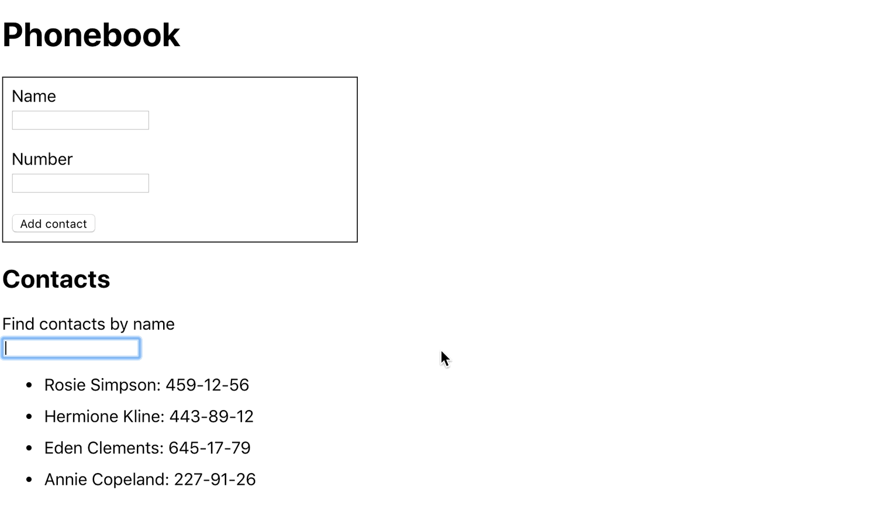
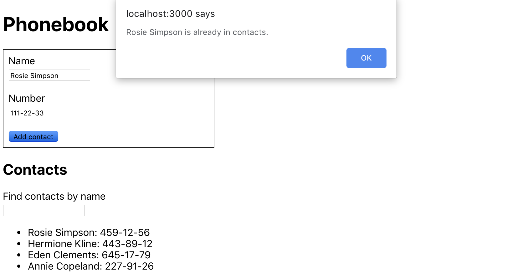

**Читать на других языках: [Русский](README.md), [Українська](README.ua.md).**

# Критерии приема

## Книга контактов

- Создан репозиторий `goit-react-hw-04-hooks-phonebook`.
- Проведи рефакторинг кода задания
  [Телефонна книга](https://github.com/vovababych/goit-react-hw-03-phonebook)
  используя React-хуки.

# Критерії прийому

- Створено репозиторії `goit-react-hw-03-phonebook` і
  `goit-react-hw-03-image-finder`
- При здачі домашньої роботи є посилання: на вихідні файли і робочу сторінку
  проектів на `GitHub pages`
- У стані компонентів зберігається мінімально необхідний набір даних, інше
  обчислюється
- При запуску коду завдання, в консолі немає помилок і попереджень
- Для кожного компонента є окрема папка з файлом React-компонента і файлом
  стилів
- Для компонентів описані `propTypes`, і де необхідно, `defaultProps`
- Все що компонент очікує у вигляді пропів, передається йому при виклику
- Імена компонентів зрозумілі, описові
- JS-код чистий і зрозумілий, використовується `Prettier`
- Стилізація робиться тільки `SASS`, `CSS-модулями` або `Styled Components`,
  тому класи в результуючому DOM можуть відрізнятися від прикладів.
- Для стилізації досить позиціонування і розміри наближені до макету.
  Компоненти, в першу чергу, повинні працювати, а вже потім бути красиві,
  виділяй 20% часу на стилізацію і 80% на JS.

# Телефонна книга

Візьми своє рішення завдання з
[домашньої роботи 2](../../homework-02/phonebook/) і додай зберігання контактів
телефонної книги в`localStorage`. Використовуй методи життєвого циклу.

- При додаванні і видаленні контакту, контакти зберігаються в локальне сховище.
- При завантаженні програми, контакти, якщо такі є, зчитуються з локального
  сховища і записуються в стан.

**Читать на других языках: [Русский](README.md), [Українська](README.ua.md).**

# Телефонна книга

Напиши додаток зберігання контактів телефонної книги.

## Крок 1

Додаток має складатися з форми і списку контактів. На поточному етапі реалізуй
додавання імені контакту та відображення списку контактів. Додаток не має
зберігати контакти між різними сесіями (оновлення сторінки).

Стан зберігається в батьківському компоненті `<App>` обов'язково має бути
наступного виду, додавати нові властивості не можна.

```bash
state = {
  contacts: [],
  name: ''
}
```

Кожен контакт повинен бути об'єктом з властивостями `name` і `id`. Для генерації
ідентифікаторів використовуй будь-який відповідний пакет, наприклад
[uuid](https://www.npmjs.com/package/uuid#version-4). Після завершення цього
кроку, додаток повинен виглядати приблизно так.


## Крок 2

Розшир функціонал додатка, дозволивши користувачам додавати номера телефонів.
Для цього додай другий інпут в форму, і властивість для зберігання його значення
в стані.

```bash
state = {
  contacts: [],
  name: '',
  number: ''
}
```

Після завершення цього кроку, додаток повинен виглядати приблизно так.


## Крок 3

Додай поле пошуку, яке можна використовувати для фільтрації списку контактів по
імені.

- Поле пошуку це інпут без форми, значення якого записується в стан
  (контрольований елемент).
- Логіка фільтрації повинна бути нечутлива до регістру.

```bash
state = {
  contacts: [],
  filter: '',
  name: '',
  number: ''
}
```



Коли ми працюємо над новим функціоналом, буває зручно жорстко закодувати деякі
дані в стан. Це позбавить від необхідності вручну вводити дані в інтерфейсі для
тестування роботи нового функціоналу. Наприклад можна використовувати таке
початковий стан.

```bash
state = {
  contacts: [
    {id: 'id-1', name: 'Rosie Simpson', number: '459-12-56'},
    {id: 'id-2', name: 'Hermione Kline', number: '443-89-12'},
    {id: 'id-3', name: 'Eden Clements', number: '645-17-79'},
    {id: 'id-4', name: 'Annie Copeland', number: '227-91-26'},
  ],
  filter: '',
  name: '',
  number: ''
}
```

## Крок 4

Якщо твій додаток реалізовано в одному компоненті `<App>`, виконай рефакторинг,
виділивши відповідні частини в окремі компоненти. В стані кореневого компонента
`<App>` залишаться тільки властивості `contacts` і `filter`.

```bash
state = {
  contacts: [],
  filter: ''
}
```

Досить виділити чотири компоненти: форма додавання контактів, список контактів,
елемент списку контактів і фільтр пошуку.

Після рефакторинга кореневий компонент додатка буде виглядати так.

```html
<div>
  <h1>Phonebook</h1>
  <ContactForm ... />

  <h2>Contacts</h2>
  <Filter ... />
  <ContactList ... />
</div>
```

## Крок 5

Заборони користувачеві можливість додавати контакти, імена яких вже є в
телефонній книзі. При спробі виконати таку дію виведи `alert` з попередженням.



## Крок 6

Розшир функціонал додатка, дозволивши користувачеві видаляти раніше збережені
контакти.


